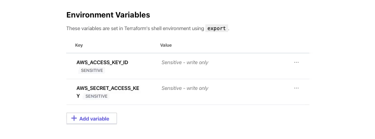
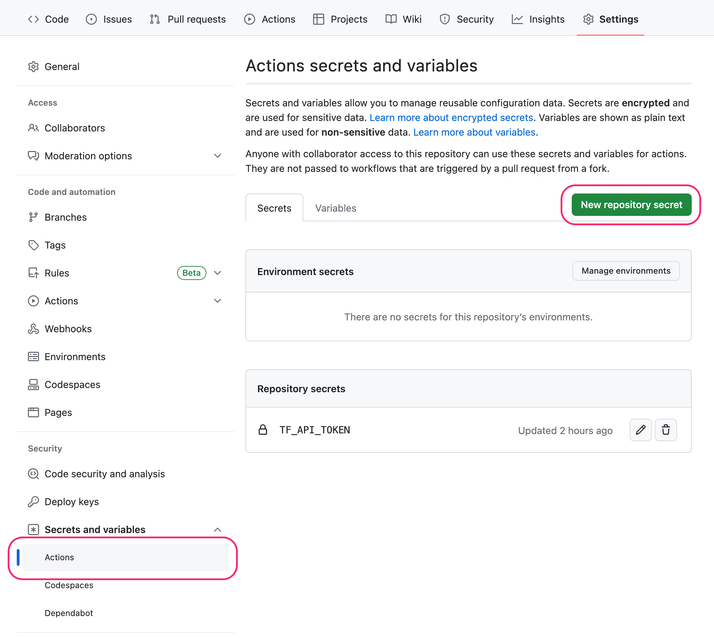
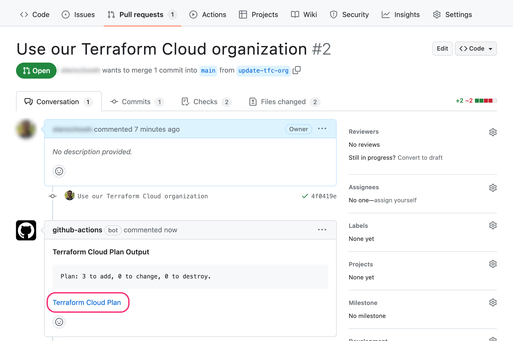
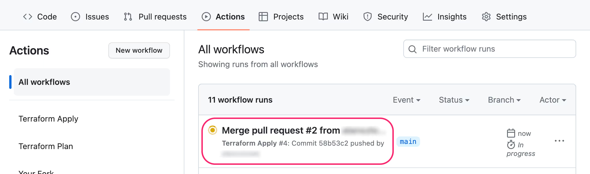
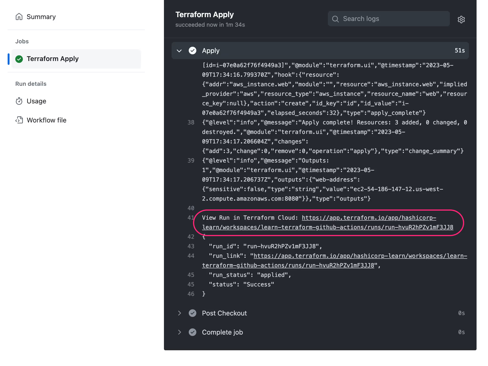
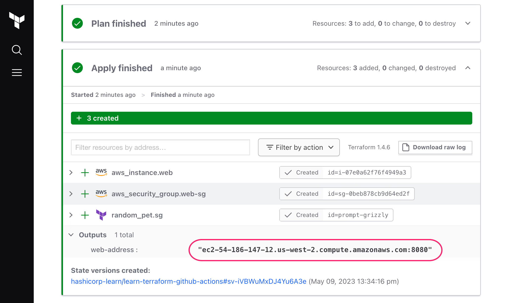

# Class 6: Automating Terraform with GitHub Actions

## Step 1: Preparing AWS

1. **Log in to AWS**  
   - Access your AWS account at [AWS Console](https://aws.amazon.com/console/).  

2. **Navigate to IAM Dashboard**  
   - Once logged in, type "IAM" in the search bar and navigate to the Identity and Access Management dashboard.

3. **Set Up IAM Permissions**  
   - Click **User Groups** in the left-hand menu.
   - Create a new user group with these permissions
     - **AdministratorAccess**
     - **AmazonAPIGatewayAdministrator**
     - **SystemAdministrator**
   - Save the user group.  

4. **Create an IAM User**  
   - Go back to the IAM dashboard and select **Users** from the left-hand menu.
   - Click **Create Users**:
     - Enter the user name `Terraform`.
     - Click "Next"
   - Assign the user to the previously created user group.
   - Finish creating the user.  

5. **Generate Access Keys**  
   - Click the new user.
   - Under the **Summary**, click "Create Access Key."
   - Command Line Interface (CLI)
   - Click "I understand the above recommendation and want to proceed to create an access key."
   - Create access key
   - Save the Access Key ID and Secret Access Key.  

---

## Step 2: Setting Up Terraform Cloud

1. **Sign Up or Log In**  
   - Go to [Terraform Cloud](https://app.terraform.io). If you don’t already have an account, click "Sign Up."  

2. **Create an Organization**  
   - Once logged in, navigate to the **Organizations** tab.
   - Click "Create New Organization."
   - Name the organization appropriately and click "Create."  

3. **Set Up a Workspace**  
   - Inside the organization, create a new workspace:
     - Default Project
     - Choose "API-Driven Workflow" if you are integrating with GitHub.
     - Name the workspace (e.g., "learn-terraform-github-actions").
   - Complete the setup.  

4. **Add AWS Environment Variables**  
   - Navigate to thebanner on the left side.
   - Select "Variables"
   - Under "Workspace variables," add the following environment variables:
     - `AWS_ACCESS_KEY_ID`
     - `AWS_SECRET_ACCESS_KEY`
   - Paste the values saved from Step 1.
   - Select "Environment variable"
   - Select "Sensitive"
     

5. **Generate a Terraform Cloud API Token**  
   - Go to your **Account Settings** in Terraform Cloud.
     - Left side banner
     - Click on profile picture
     - Click "Account settings"
     - Click "Tokens"
   - Under "Tokens," generate a new token and name it (e.g., "GitHub Actions").
   - Save the token for later use in GitHub Actions.  

---

## Step 3: Setting Up GitHub Repository

1. **Fork the Repository**  
   - Navigate to [Theo's repository](https://github.com/MookieWAF/learn-terraform-github-actions2) and click "Fork."
   - Create fork  

2. **Add Terraform Cloud Token as a GitHub Secret**  
   - In your forked repository, navigate to **Settings > Secrets and Variables (Left side banner) > Actions**.
   - Click "New Repository Secret."
   - Name it `TF_API_TOKEN` and paste the Terraform Cloud API token.
   - Add secret
     

3. **Clone the Repository**  
   - On your local machine, create a folder for the project.
   - Open a terminal and run the following command:
     ```bash
     git clone <repository-url>
     ```
   - Navigate into the repository directory:
     ```bash
     cd <repository-name>
     ```  

---

## Step 4: Updating Terraform Configuration Locally

1. **Open the Repository in Visual Studio Code**  
   - Use `cd` to navigate to the repository folder in your terminal.
   - Open the repository in Visual Studio Code:
     ```bash
     code .
     ```  

2. **Update Terraform Configuration**  
   - Open the `main.tf` file.
   - Locate the `cloud` block and update it with:
     - Your Terraform Cloud organization name.
     - Your workspace name. 
       ```
       cloud { 
    
        organization = "your_organization" 

        workspaces { 
            name = "your_workspace" 
        }  
        ``` 

3. **Save and Commit Changes**  
   - Save the updated file.
   - Create a new branch:
     ```bash
     git checkout -b 'update-tfc-org'
     ```
   - Stage and commit your changes:
     ```bash
     git add main.tf
     git commit -m "Use our HCP Terraform organization"
     ```  

4. **Push Your Changes**  
   - Push the branch to GitHub:
     ```bash
     git push -u origin update-tfc-org
     ```  

---

## Step 5: Deploying Terraform Plan via GitHub Actions

1. **Create a Pull Request (PR)**  
   - On GitHub, go to your repository.
   - Click "Pull Requests"
   - Click "New"
   - For "base repository" select your repo
   - For compare: select "update-tfc-org"
   - Create it.  

2. **Wait for Workflow Validation**
   - On the pull request page wait for the check to be done
   - Ensure it completes successfully.  
   

3. **Merge the Pull Request**  
   - Once the workflow completes, merge the PR into the main branch.  

4. **Verify Deployment**  
   - Check the `terraform.yml` workflow in GitHub Actions to confirm success.
     - Click "Actions" on your repo
       
     - Click on the latest run
        
   - Log in to Terraform Cloud and review the "Runs" section for the latest run.  
   

5. **Validate Resources in AWS Console**  
   - Log in to the AWS console and confirm that the resources specified in `main.tf` are created.  

---

## Step 6: Cleaning Up Resources

1. **Destroy Resources in Terraform Cloud**  
   - Navigate to your workspace settings in Terraform Cloud.
     - Left side banner
     - "Settings"
     - "Destruction and Deletion"
   - Queue a destroy plan and confirm the action.  

2. **Monitor Resource Deletion**  
   - Watch the "Runs" section in Terraform Cloud to ensure the destroy process completes.  

3. **Verify Deletion in AWS**  
   - Confirm that all resources have been deleted. 

---

## Troubleshooting

1. **Run `terraform fmt`**
   - Ensure your Terraform files are properly formatted. Run the following command locally:
     ```bash
     terraform fmt
     ```
   - Commit and push any changes made by the formatter.

2. **Default Provider Issue**
   - Verify that your `provider` block includes a default provider configuration. Providers cannot all be aliased.

3. **STS Caller Identity Error**
   - This error usually indicates an issue with AWS credentials. Check the following:
     - Ensure the IAM user has the correct permissions.
     - Verify that `AWS_ACCESS_KEY_ID` and `AWS_SECRET_ACCESS_KEY` are correctly set in Terraform Cloud variables.
     - Confirm that the access keys are not expired.

4. **Check GitHub Secrets**
   - Ensure the `TF_API_TOKEN` secret is correctly configured in your GitHub repository under **Settings > Secrets and Variables > Actions.**

5. **Validate Configuration**
   - Run `terraform validate` locally to ensure your Terraform configuration is syntactically correct:
     ```bash
     terraform validate
     ``` 
---

## Actually do this so you can get a job - Jourdan


